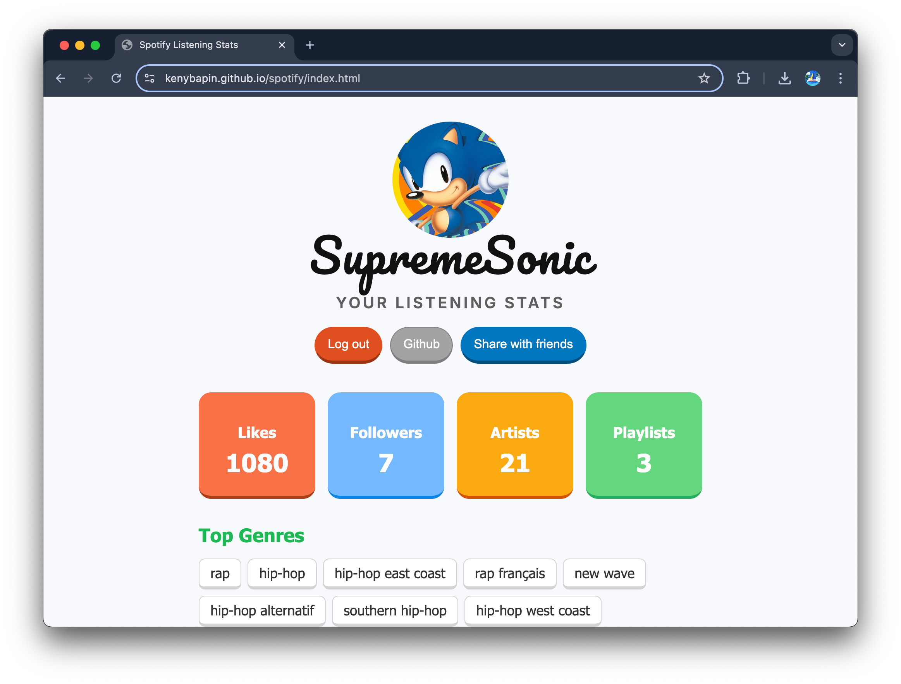

# JS Spotify Web App 



This web app is a Spotify stats dashboard that gives you a clear view of your music habits. It securely logs you in using Spotify’s Authorization Code flow with Proof Key for Code Exchange (PKCE). You can explore your liked songs, follower count, playlists, recently played tracks, and more. Additionally, you can generate and share a visually summarized image of your stats.

## Requirements
* Install a local web server.
* A Spotify account ([sign up here](https://www.spotify.com)).
* Create a spotify APP : Go to your [Spotify Developer Dashboard](https://developer.spotify.com/dashboard/login) and create an app:
  - Note your **CLIENT ID**
  - In the app settings, add the redirect URI *(Change the port number according to your web server's setting)*:  
    `http://127.0.0.1:<port>/api_callback`  
    

## Setup

1. Open a terminal : 
```
git clone https://github.com/kenybapin/spotify.git
```
2. Modify the `clientId` and `redirectUri` in script.js
3. Run index.html with a web server.


By default, your app is in **developer mode**, which only allows access to your own data. Other users will automatically receive a **403 error**.<br>
To let others test your app: Go to *App > Settings > User Management* in the [Dashboard](https://developer.spotify.com/dashboard/login) and add the users.<br>
For wider access Go to *App > Extension Request*. Spotify will review your app to ensure it complies with their [Developer Policy](https://developer.spotify.com/policy).


--


# Notes

- This app uses the **PKCE extension** of the OAuth 2.0 Authorization Code Flow.  
  No app secret is needed, as the code-to-token swap requires a one-time **code_verifier**.

- **callback.html** handles the OAuth process: it retrieves the code, exchanges it for a token, stores it, and then redirects.

- Clicking the Logout button clears the **access_token** and its expiry from **localStorage**.  
  The page reloads, and without a token, the user is prompted to log in again.


--


# Spotify Authorization Flow

1. **Generate Code & Redirect**  
   - Create a `code_verifier` and `code_challenge`.  
   - Redirect the user to Spotify’s `/authorize` page with:
     - `client_id`
     - `redirect_uri`
     - `scope`
     - `code_challenge`

2. **User Login & Approval**  
   - The user signs into Spotify and grants access.

3. **Receive Authorization Code**  
   - Spotify redirects to `callback.html` with a `code`.  
   - Exchange the `code` via POST to `/api/token` using the `code_verifier`.

4. **Receive Access Token**  
   - Spotify responds with:
     - `access_token`
     - `expires_in`

5. **Store Token & Redirect**  
   - Save the token and expiry in `localStorage`.  
   - Redirect the user to the main page (`index.html`).

6. **API Requests**  
   - Make API requests using `Authorization: Bearer <token>`.  
   - If the token is expired, repeat from Step 1.


